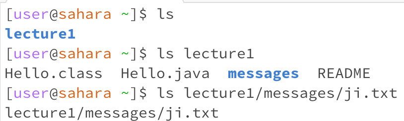
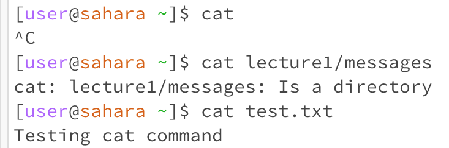

# Lab Report 1 by Lindsey Rappaport
## *Remote Access and FileSystem (Week 1)*
## CS 15L

**cd command:**  

The first line demonstrates the cd command using **no arguments**. The working directory here was home. No output was produced because we did not specify a directory to change to. This was not an error.  
The second line demonstrates the cd command using the lecture1 **directory as an argument**. The result of this was a change in directory. As displayed in the following line, it changed the working directory to lecture1. This was not an error.  
The third line demonstrates the cd command using a **file as the argument**. The working directory here was lecture1. This produced an error because the cd command is used for switching directories, not files. Since ji.txt is a file and not a directory, it produced an error.  

**ls command:**  
 
The first line demonstrates the ls command using **no arguments**. The working directory here was home. The output was lecture1 because it listed all files/directories in the home directory. This was not an error.  
The second line demonstrates the ls command using the lecture1 **directory as an argument**. The result of this was a change in directory and thus a change in the files/directories listed. Now we see the files/directories listed in lecture1 rather than home. The working directory here was home, since we did not change directories. This was not an error.  
The third line demonstrates the ls command using a **file as the argument**. This displayed the path to the specified file. Since ls is used to list files within a collective, using a file as an argument just produces a copy of the specified path to said file. The working directory here was home. This was not an error.  

**cat command:**  

The first line demonstrates the ls command using **no arguments**. The working directory here was home. The output was a writing function that can be exited using control+c. This occurred because we did not specify a file to create or write on, so it basically produced an empty writing function. This was not an error.  
The second line demonstrates the ls command using the messages **directory as an argument**. The result of this was an error because the cat command is meant to be used to create and view files, not directories. The working directory here was home.  
The third line demonstrates the ls command using a **file as the argument**. This displayed the contents of the specified file as output. The working directory here was home. This was not an error.  
