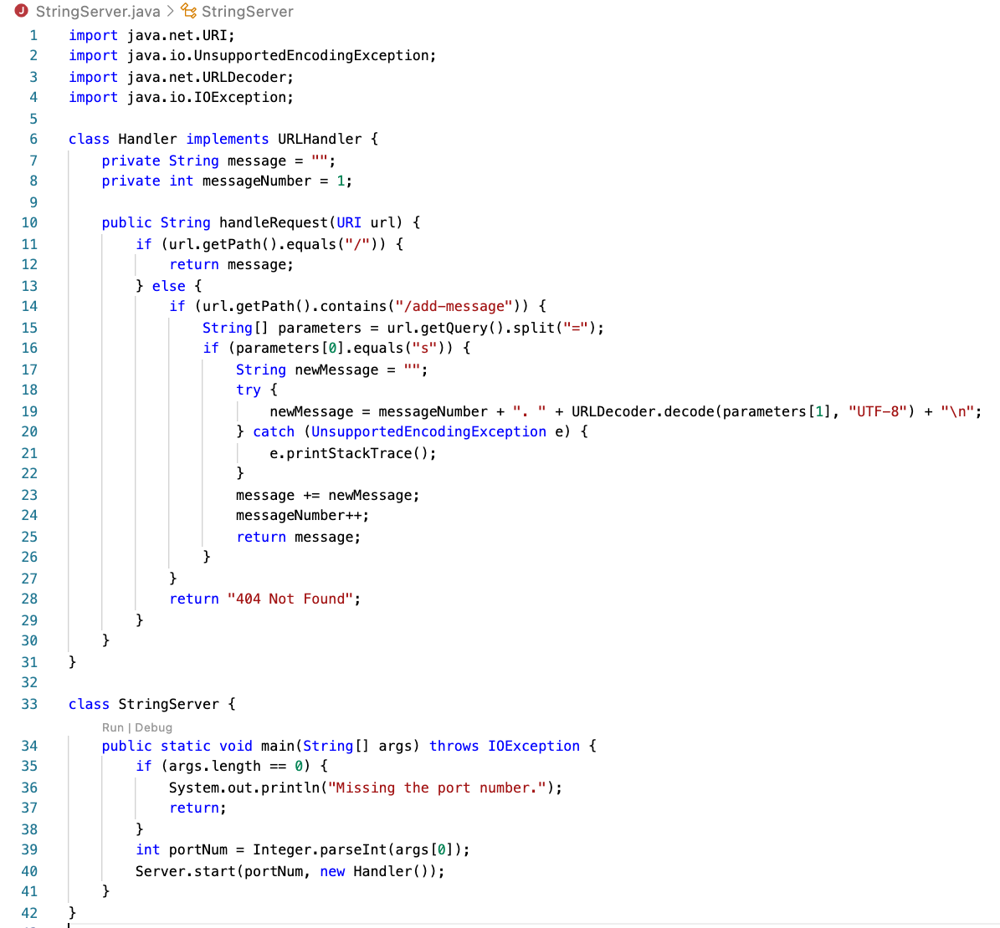
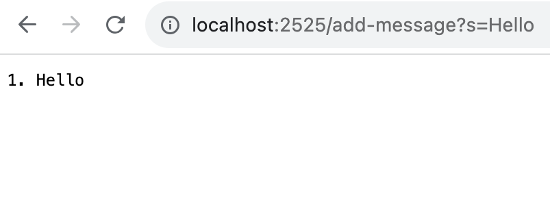
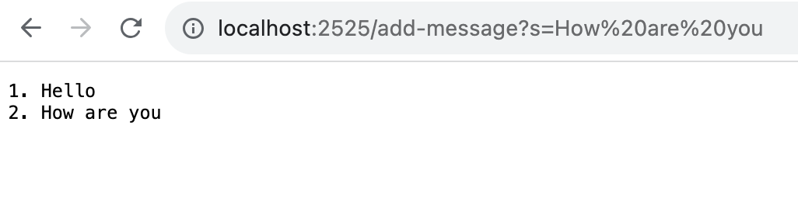
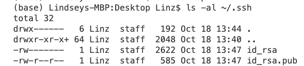
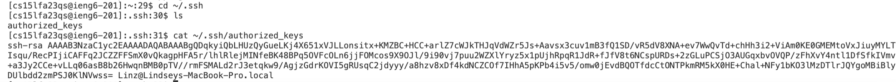
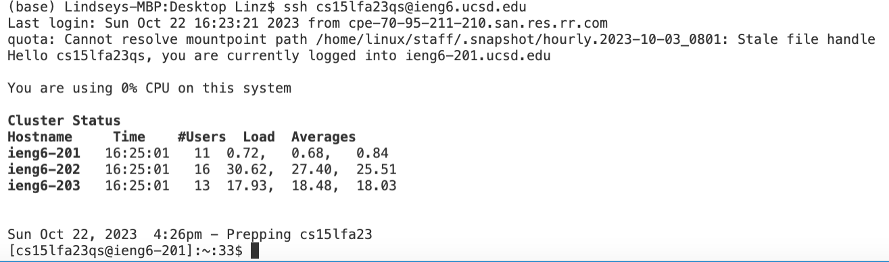

# Lab Report 2 by Lindsey Rappaport
## *Week 3 - VSCode and Your Local Machine*
## CS 15L

## **Part 1:**  
**Code for StringServer:**  
  
This is the code written in Visual Studios for StringServer.java.  
**Using /add-message twice:**  
  
This screenshot demonstrates using /add-message the first time with "Hello." Here, a few different methods are called. The handleRequest(URI url) method from the Handler class is one of them. When called, it takes in the request, adds the specified message, and then prints the list of messages. The relevant argument for this method within the Handler class is the url. The relevant fields of the Handler class are message and messageNumber. The message value gets updated with the first phrase put into the server. Here, the value is updated with "Hello." The messageNumber value increases by 1, indicating the updated message number for the future messages. The newMessage value acts as a temporary holder for this message. These actions take place within the handleRequest(URI url) method during request processing. The argument, url, is not updated by the server since it's a parameter in the code. Another method called here is "start" in Server.java (which starts the server). The start method takes in two arguments, port & handler. Port is the port number that the server runs on. Handler represents the handler that processes HTTP requests and creates responses. Another method called is the main method in StringServer.java. The StringServer class doesn't alter values related to messages when it is handling requests since it's not responsible for dealing with message content or requests. There aren't any relevant fields that are changed during the start and main methods.
 
  
This screenshot demonstrates using /add-message the second time with "How are you." Here, the same method, handleRequest(URI url) method from the Handler class, is called. The relevant argument for this method within the Handler class is still the url. The relevant fields of the Handler class are still message and messageNumber. The message value gets updated with the new phrase put into the server. Here, it is "How are you." The messageNumber value increases again by 1. The newMessage value acts again as a temporary holder for the new message. These actions take place within the handleRequest(URI url) method during request processing. The argument, url, is again not updated by the server since it's a parameter in the code. The main method and start method are not called here because those only occur in the initialization of the server.
 

## **Part 2:**  
**Path to Private Key:**  
  
**Path to Public Key:**  
  
**Successful Login with no Password:**  
  

## **Part 3:**  
During weeks 2 and 3, I learned about using methods in servers to edit files using the search bar, which I have never done before. I also learned about the use of private and public keys to gain access to remote servers without having to use a password each time which is very useful.
 
