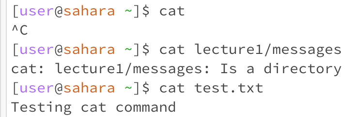

# Lab Report 2 by Lindsey Rappaport
## *Week 3 - VSCode and Your Local Machine*
## CS 15L

## **Part 1:**  
**Code for StringServer:**  
  
This is the code written in Visual Studios for StringServer.java.  
**Using /add-message twice:**  
  
This screenshot demonstrates using /add-message the first time with "Hello." Here, a few different methods are called. The handleRequest(URI url) method from the Handler class is one of them. When called, it takes in the request, adds the specified message, and then prints the list of messages. The relevant argument for this method within the Handler class is the url. The relevant fields of the Handler class are message and messageNumber. The message value gets updated with the first phrase put into the server. The messageNumber value increases by 1, indicating the updated message number for the future messages. The newMessage value acts as a temporary holder for this message. These actions take place within the handleRequest(URI url) method during request processing. The argument, url, is not updated by the server since it's a parameter in the code. Another method called here is "start" in Server.java (which starts the server). The start method takes in two arguments, port & handler. Port is the port number that the server runs on. Handler represents the handler that processes HTTP requests and creates responses. Another method called is the main method in StringServer.java. The StringServer class doesn't alter values related to messages when it is handling requests since it's not responsible for dealing with message content or requests. There aren't any relevant fields that are changed during the start and main methods.
 
  
This screenshot demonstrates using /add-message the second time with "How are you." Here, the same method, handleRequest(URI url) method from the Handler class, is called. The relevant argument for this method within the Handler class is the url. The relevant fields of the Handler class are message and messageNumber. The message value gets updated with the new phrase put into the server. The messageNumber value increases again by 1. The newMessage value acts again as a temporary holder for the new message. These actions take place within the handleRequest(URI url) method during request processing. The argument, url, is not updated by the server since it's a parameter in the code. The main method and start method are not called here because those only occur in the initialization of the server.
 

## **Part 2:**  
 
The first line demonstrates the ls command using **no arguments**. The working directory here was home. The output was lecture1 because it listed all files/directories in the home directory. This was not an error.  
The second line demonstrates the ls command using the lecture1 **directory as an argument**. The result of this was a change in directory and thus a change in the files/directories listed. Now we see the files/directories listed in lecture1 rather than home. The working directory here was home, since we did not change directories. This was not an error.  
The third line demonstrates the ls command using a **file as the argument**. This displayed the path to the specified file. Since ls is used to list files within a collective, using a file as an argument just produces a copy of the specified path to said file. The working directory here was home. This was not an error.  

## **Part 3:**  
  
The first line demonstrates the cat command using **no arguments**. The working directory here was home. The output was a writing function that can be exited using control+c. This occurred because we did not specify a file to create or write on, so it basically produced an empty writing function. Within this writing function, submitting new input writes to an unspecified file. This was not an error.  
The second line demonstrates the cat command using the messages **directory as an argument**. The result of this was an error because the cat command is meant to be used to create and view files, not directories. The working directory here was home.  
The third line demonstrates the cat command using a **file as the argument**. This displayed the contents of the specified file as output. The working directory here was home. This was not an error. You can also use cat to create and write to a new file by running "cat < (file name)". Once you write what you want in the new file, you can use control+c to stop the writing function.  
