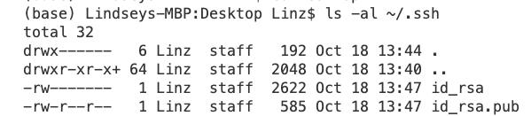

# Lab Report 3 by Lindsey Rappaport
## *Week 5 - Bugs and Commands*
## CS 15L

## **Part 1-Bugs:** <br/>
**Failure Inducing Input in Test:** <br/>
```
public void testReverseInPlace() {
    int[] input1 = {3,1};
    ArrayExamples.reverseInPlace(input1);
    assertArrayEquals(new int[]{1,3}, input1);
  }
```
<br/>
**Input that does not Induce Failure in Test:** <br/>
```
public void testReverseInPlace() {
    int[] input1 = {3};
    ArrayExamples.reverseInPlace(input1);
    assertArrayEquals(new int[]{3}, input1);
  }
```
<br/>
**Symptom:** <br/>
**With Failure Inducing Input:** <br/>
 <br/>
**With Input that does not Induce Failure:** <br/>
 <br/>


## **Part 2-Researching Commands:** <br/>
**Path to Private Key:** <br/>
 <br/>
**Path to Public Key:** <br/>
 <br/>
**Successful Login with no Password:** <br/>
 <br/>

