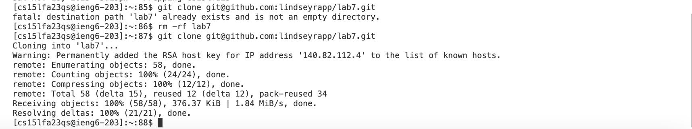
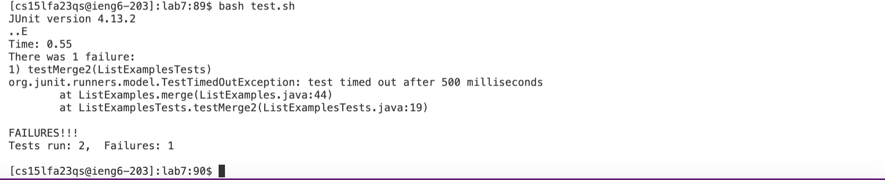
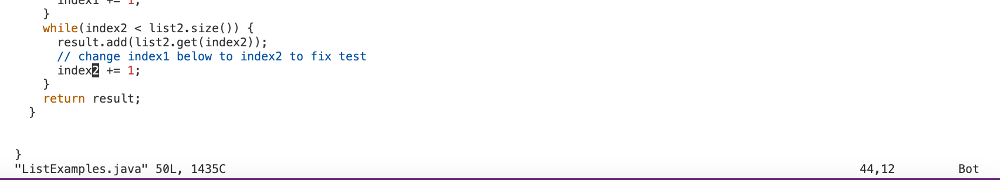
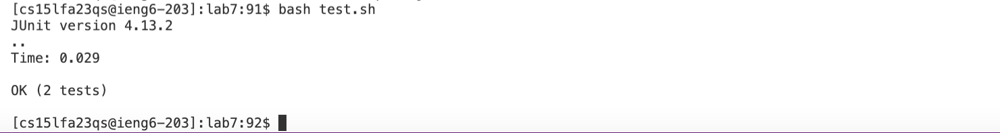
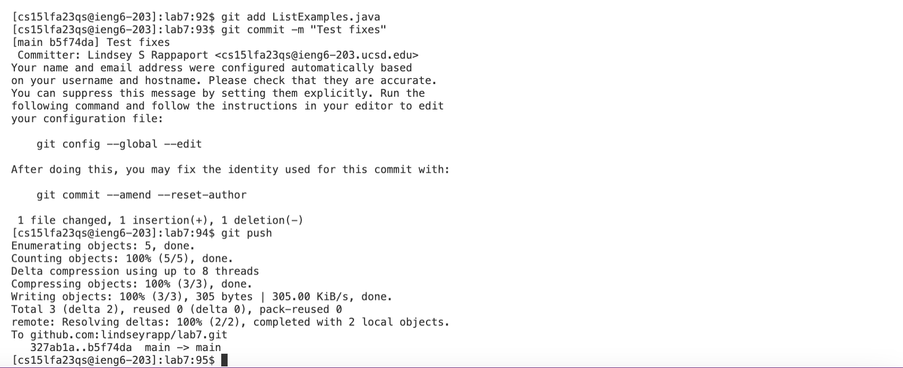

# Lab Report 4 by Lindsey Rappaport

## *Week 7 - Vim*

## CS 15L

My baseline time for this lab was 27 seconds and my improved time was 21 seconds. My best tip for efficiency is using test.sh to run tests. I am comfortable with this process because I use these techniques/commands frequently in my job, hence the fast baseline time.

## **Log into ieng6:**  

  

In order to log into the remote server ieng6, I typed `ssh cs15lfa23qs@ieng6.ucsd.edu` into the command line and then pressed `<enter>` which allowed me to log in without entering a password (since we set it up prior to this process).

 

## **Clone fork of the repository from Github account (using the SSH URL):**  

  

In order to clone my forked repository, I typed `git clone git@github.com:lindseyrapp/lab7.git` into the command line and then pressed `<enter>` which cloned the repository into my remote server using the SSH URL rather than HTTPS.

 

## **Run the tests, demonstrating that they fail:**  

  

First, I typed `cd lab7` into the command line and then pressed `<enter>`, changing my working directory to lab7 so I could access the files within it.

  

In order to demonstrate that the tests failed, I typed `bash test.sh` into the command line and then pressed `<enter>`, which ran test.sh (which includes jUnit) and executed the tests. As you can see, 1 test failed.

 

## **Edit the code file to fix the failing test:**  

  

In order to edit the test file, I typed `vim ListExamples.java` into the command line and then pressed `<enter>`, which opened the ListExamples.java file and the Vim editor.

  

Here, you can see the replaced code after the fix. To achieve this, I pressed `?` `1` `<enter>` `n` `r` `2` `<enter>` `:` `w` `q` `<enter>`. These key presses represent me searching from the bottom of the file for "1", moving to the second "1" from the bottom (which is the one we needed to change), replacing the "1" with "2", and then simultaneously saving the changes and exiting Vim with `:wq`.

 

## **Run the tests, demonstrating that they now succeed:**  

  

In order to demonstrate that the tests passed, I pressed `<up>` `<up>` which went into the command line history and pasted `bash test.sh` into the command line. I then pressed `<enter>`, which ran test.sh and executed the tests. As you can see, the tests succeeded after the previous change was made to ListExamples.java.

 

## **Commit and push the resulting change to your Github account:**  

  

In order to add the change to the commit, I typed `git add ListExamples.java` into the command line and then pressed `<enter>`, which added the changes made to this file to the commit. Next, to commit the changes, I typed `git commit -m "Test fixes"` into the command line and then pressed `<enter>`, which saved the updates made under the title message, "Test fixes". Finally, I typed `git push` into the command line and then pressed `<enter>`, which pushed the changes to the main branch of the repository.

 

