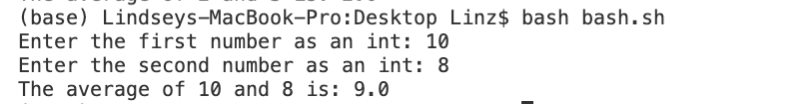

# Lab Report 5 by Lindsey Rappaport
## *Week 9 - Putting It All Together*
## CS 15L

## **Part 1:**  
**EdStem Question:**  
  
This is the question posted on edStem with the failure-inducing input and symptom.
**EdStem TA Response:**  
  
This is the response from the "TA" with a suggestion on commands to run to identify the bug.
 
**Trying Out the Suggestions:**  
  
This is an attempt at entering two even integers as input. It returned the correct average. Because of this result, I will now try the next commands the TA suggested.
 
  
This is an attempt at entering two even integers as input. It returned the correct average.
 

## **Part 2:**  
**Path to Private Key:**  
  
**Path to Public Key:**  
  
**Successful Login with no Password:**  
  

## **Part 3:**  
During weeks 2 and 3, I learned about using methods in servers to edit files using the search bar, which I have never done before. I also learned about the use of private and public keys to gain access to remote servers without having to use a password each time which is very useful.
 
