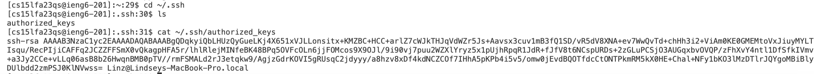

# Lab Report 5 by Lindsey Rappaport
## *Week 9 - Putting It All Together*
## CS 15L

## **Part 1:**  
**EdStem Question:**    
  
This is the question posted on edStem with the failure-inducing input and symptom.
 
 
**EdStem TA Response:**  
  
This is the response from the "TA" with a suggestion on commands to run to identify the bug.
 
 
**Trying Out the Suggestions:**  
  
Here, I followed the TA's advice and entered two even integers as input. It returned the correct average. Because of this result, I ran the cat command to inspect the code and found that the TA's prediction was correct: the return type was incorrect for the findAvg function.
 
 
  
Here, as suggested, I used vim to fix the code. I entered insert mode and changed the return type for findAvg. I also changed the "2" to "2.0" in the equation to be consistent with doubles.
 
 
  
Here, I ran the bash script with the new and improved code. I entered the same integers that originally caused failure, and the code returned the correct value this time.
 
 
**Necessary Information:**  
  
This was the code in AverageCalculator.java **BEFORE** the bug was fixed. This file was stored in the Desktop directory on my computer.
 
 
  
This was the contents of the bash script, which did not change throughout the process. This file was stored in the Desktop directory on my computer.
 
 
  
Here is the full command line that was run to produce the original symptom. 
 
 
How I fixed it: To fix the bug, I changed the return type from int to double for the findAvg function. I also changed the 2 in the equation to 2.0.

## **Part 2:**  
**Path to Private Key:**  
  
**Path to Public Key:**  
  
**Successful Login with no Password:**  
  

## **Part 3:**  
During weeks 2 and 3, I learned about using methods in servers to edit files using the search bar, which I have never done before. I also learned about the use of private and public keys to gain access to remote servers without having to use a password each time which is very useful.
 
